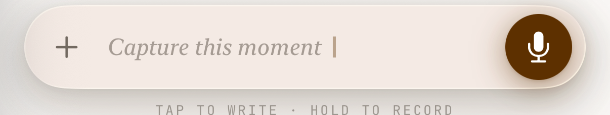

# DayPage · Liquid Glass vNext 改造蓝图

> 目标:把 DayPage 的 UI 从「iOS 16 手工仿玻璃」升级为「iOS 26 原生 Liquid Glass + 旧版优雅降级」的双轨形态。
> 工具链:Xcode 26.4 / Swift 5 / 部署目标保持 **16.0**。
> 设计基调:延续「日式美术馆 / 暖米白」语言,玻璃只用在功能层,不污染内容层。

---

## 0. TL;DR

- **现状**:`LiquidGlassCard` 用 `.ultraThinMaterial` + 暖色 tint + 双层描边 + 双层阴影**伪造**玻璃。静态、无折射、无高光游走、无形变、无合并。视觉天花板被 iOS 16 API 压死。
- **机会**:玻璃已收敛成 `LiquidGlassCard / glassSurface / glassDisc / liquidGlassPanel / liquidGlassPill` 等少数 modifier。**只换 modifier 内部实现,19 个调用文件几乎不动。**
- **路线**:双轨制。`if #available(iOS 26)` 走原生 `.glassEffect()`,否则 fallback 到现有实现。
- **边界**:Liquid Glass 是**功能层/控件层**语言。内容卡(MemoCard)保持 `SolidCard` 白底——这是 Apple 明确立场,不是妥协。

---

## 1. 现状诊断

### 1.1 已经做对的事(改造杠杆)

| 资产 | 位置 | 价值 |
|---|---|---|
| 玻璃 modifier 抽象层 | `DesignSystem/Surfaces.swift` | 调用点只认 `.liquidGlassCard()`,换内部实现零成本扩散 |
| `GlassSurfaceModifier` 已处理 Reduce Transparency | `Colors.swift:255` | 无障碍降级已就位,原生 API 也需要它 |
| Elevation 三档抽象 | `Elevation.swift` | 阴影统一,原生玻璃自带阴影时可收敛 |
| 暖色 token 体系 | `Colors.swift` (v4 段) | `glassStd/Hi/Lo` + `glassEdge/Rim` 已成系统 |
| 内容卡已脱离玻璃 | `SolidCard` (MemoCard 用白底) | 符合 Apple 反模式约束,无需返工 |

### 1.2 核心矛盾:四个 Liquid Glass 灵魂特性,`ultraThinMaterial` 一个都给不了

| 特性 | 原生 Liquid Glass | 当前仿玻璃 |
|---|---|---|
| **实时折射(Lensing)** | 边缘像透镜掰弯背景内容 | ❌ 仅均匀模糊 |
| **镜面高光游走(Specular)** | 随倾斜/滚动动态游走 | ❌ 静态 `LinearGradient` 描边 |
| **流动合并(Morph/Merge)** | 玻璃元素靠近时水银般融合 | ❌ 完全没有 |
| **交互形变(Interactive)** | 按下时玻璃软化变形 | ❌ 静态 |

### 1.3 调用分布(改造影响面)

- 19 个文件直接调 `ultraThinMaterial/regularMaterial/thinMaterial`
- 13 个文件调自定义 glass modifier
- 仅 1 处 `if #available(iOS 16)`,4 处 iOS 17 — **没有任何 iOS 26 分支**

---

## 2. 双轨架构设计

### 2.1 核心思路:一个内部分发器,统一所有玻璃 modifier 的底座

新增 `DesignSystem/LiquidGlassEngine.swift`,提供一个 `dpGlass(...)` 内部方法,封装版本分发:

```swift
import SwiftUI

/// 玻璃形状的语义角色 — 决定原生 glassEffect 的 variant 与 fallback tone。
enum GlassRole {
    case control     // 输入坞按钮、悬浮控件 → .regular.interactive()
    case panel       // sheet/抽屉/菜单     → .regular
    case pill        // chip/tag/badge      → .regular
    case toast       // 临时提示            → .regular
}

extension View {
    /// 双轨玻璃底座。iOS 26 走原生 Liquid Glass,旧版 fallback 到现有暖色仿玻璃。
    @ViewBuilder
    func dpGlass<S: Shape & InsettableShape>(
        _ role: GlassRole,
        in shape: S,
        tone: GlassTone = .std
    ) -> some View {
        if #available(iOS 26.0, *) {
            self.modifier(NativeGlassModifier(role: role, shape: shape, tone: tone))
        } else {
            self.modifier(LegacyGlassModifier(shape: shape, tone: tone))
        }
    }
}
```

### 2.2 原生分支(iOS 26)

```swift
@available(iOS 26.0, *)
private struct NativeGlassModifier<S: Shape & InsettableShape>: ViewModifier {
    let role: GlassRole
    let shape: S
    let tone: GlassTone
    @Environment(\.accessibilityReduceTransparency) private var reduceTransparency

    func body(content: Content) -> some View {
        if reduceTransparency {
            // 无障碍:回退到不透明暖色填充
            content.background(tone.fill.opacity(0.96), in: shape)
                   .overlay(shape.strokeBorder(tone.rim, lineWidth: 0.5))
        } else {
            switch role {
            case .control:
                content.glassEffect(.regular.tint(DSColor.amberSoft).interactive(), in: shape)
            case .panel, .pill, .toast:
                content.glassEffect(.regular.tint(DSColor.amberSoft), in: shape)
            }
        }
    }
}
```

**关键 API 速查(iOS 26):**
- `.glassEffect(_:in:)` — 给单个视图加玻璃,`in:` 指定形状(Capsule / RoundedRectangle / Circle)
- `.glassEffect(.regular.tint(color).interactive())` — 暖色染色 + 交互形变
- `GlassEffectContainer { ... }` — 包裹多个玻璃元素,让它们靠近时**流动合并**(用于输入坞的按钮群)
- `.glassEffectID(_:in:)` + `@Namespace` — 玻璃元素间的合并/分离过渡动画
- `.buttonStyle(.glass)` — 系统玻璃按钮样式
- 容器层面:`.toolbar` / `.tabViewStyle` / sheet 在 iOS 26 SDK 编译时**自动玻璃化**,部分无需手动改

### 2.3 旧版分支(iOS 16–25)

直接复用现有 `LiquidGlassCard` / `GlassSurfaceModifier` 实现,**一行不改**。这是双轨制的安全网。

### 2.4 暖色基调保护

原生 Liquid Glass 默认偏中性。为守住「日式美术馆暖米白」语言:
- 所有 `.glassEffect()` 加 `.tint(DSColor.amberSoft)` 注入暖调
- `AmbientBackground` 的暖色光晕保留(原生玻璃会折射它,反而强化氛围)
- 避免纯系统玻璃的「冷感」破坏品牌

---

## 3. 应用范围(按层 + 用户勾选)

### 3.1 ✅ 导航/控件层 — Liquid Glass 主场

| 组件 | 文件 | 改造 |
|---|---|---|
| 输入坞胶囊 + 侧按钮 | `InputBarV4.swift:266/284/464` | `dpGlass(.control, in: Capsule())`,整个坞用 `GlassEffectContainer` 让按钮群可合并 |
| 侧边栏抽屉 | `SidebarView.swift` | `dpGlass(.panel, in: RoundedRectangle)` |
| 悬浮提示 toast | `InputBarV4.swift:266` | `dpGlass(.toast, in: Capsule())` |
| Undo Pill | `UndoPillView.swift` | `dpGlass(.pill, in: Capsule())` |
| 录音浮窗 | `RecordingOverlayView.swift` | `dpGlass(.panel, ...)` + interactive |
| GlassDisc 圆形控件 | `GlassSurface.swift:56` | 原生 `.glassEffect(.regular.interactive(), in: Circle())` |

### 3.2 ✅ Sheet/弹窗/菜单层

| 组件 | 文件 | 改造 |
|---|---|---|
| 写作 sheet | `WriteSheetView.swift:735` | iOS 26 sheet 容器自动玻璃化 + 内部控件 `dpGlass` |
| 附件菜单 | `AttachmentMenuPopover.swift` | `dpGlass(.panel, ...)` |
| 年月选择器 | `YearMonthPicker.swift` | `dpGlass(.panel, ...)` |
| 各类 panel | `liquidGlassPanel()` | modifier 内部切原生 |

### 3.3 ✅ 全局氛围层

- `AmbientBackground`(`GlassSurface.swift:9`)保留暖色光晕
- iOS 26 下:玻璃控件会**实时折射**这层光晕,产生「暖光在玻璃边缘流动」的高级感 — 这是免费赚到的效果
- `AmberHalo` / `densityXXX` 热力图保留

### 3.4 ⚠️ 内容卡片 — 用户勾选了,但建议克制(附证据)

**Apple 官方立场(HIG · Liquid Glass):**
> "Liquid Glass works best as a distinct **functional layer** above your content... **Avoid using Liquid Glass on content-heavy surfaces** or stacking glass on glass, which reduces legibility and dilutes the effect."

**现状已经做对了:** MemoCard 早已从玻璃换成 `SolidCard`(白底 #FFF + 0.5pt hairline),代码注释明确写着「so the content reads cleanly against the warm canvas」。

**建议分级处理(而非一刀切):**

| 卡片 | 角色 | 建议 |
|---|---|---|
| MemoCard(原始记录) | 纯内容 | **保持 SolidCard 白底**。这是阅读区,玻璃 = 降低可读性 |
| AISummaryCard / 日页卡 | 内容 + 功能(可点击展开/编译) | 可做**半玻璃 hero**:卡片主体白底,但顶部操作条/状态徽章用玻璃。混合而非全玻璃 |
| OnThisDayCard / WeeklyRecap | 装饰性内容 | 可玻璃化,因为它是「漂浮的回顾」而非「正在读的内容」 |

> **决策点留给用户**:Phase 3 实施前会单独出 A/B 截图对比,看真实效果再定 AISummaryCard 是否玻璃化。不盲改。

---

## 4. 分阶段实施计划

### Phase 0 · 地基(无视觉变化,纯架构)
- [ ] 新增 `LiquidGlassEngine.swift`:`GlassRole` 枚举 + `dpGlass` 分发器 + 原生/旧版两个 modifier
- [ ] 原生分支加 `@available` 守卫,确保 16.0 仍能编译
- [ ] 单元验证:iOS 16 模拟器编译通过 + iOS 26 模拟器编译通过
- **风险:极低**(不改任何调用点)

### Phase 1 · 输入坞(最高频 · 最能体现玻璃)
- [ ] `InputBarV4` 整坞包进 `GlassEffectContainer`(仅 iOS 26 分支)
- [ ] 侧按钮 / 发送键 / toast 切 `dpGlass(.control/.toast)`
- [ ] 验证按钮群「合并/分离」动画 + 交互形变手感
- **风险:中**(输入坞是核心交互,需真机/模拟器手感验证)
- **产出:A/B 截图,作为是否继续铺开的依据**

### Phase 2 · 导航与浮层
- [ ] 侧边栏、Undo Pill、录音浮窗、附件菜单、年月选择器
- [ ] `GlassDisc` 内部切原生
- **风险:中低**

### Phase 3 · Sheet 容器 + 内容卡决策
- [ ] WriteSheet / 各 sheet 验证 iOS 26 自动玻璃化是否够用
- [ ] AISummaryCard 半玻璃 hero A/B(出截图,用户拍板)
- **风险:中**(涉及内容层边界,需确认)

### Phase 4 · 收尾与降级验证
- [ ] Reduce Transparency 全路径回归
- [ ] Dark mode 玻璃验证(暖色 token 在深色下的折射表现)
- [ ] 删除/标注废弃的旧仿玻璃死代码(仅当 16.0 不再依赖时)
- **风险:低**

---

## 5. 风险与约束

| 风险 | 缓解 |
|---|---|
| 16.0 编译原生 API 报错 | 所有原生调用包 `@available(iOS 26.0, *)` + `if #available`;CI 双目标编译 |
| 原生玻璃变「冷」,丢失暖色品牌 | 强制 `.tint(DSColor.amberSoft)`;保留 AmbientBackground |
| 内容卡玻璃化降低可读性 | 守住 MemoCard 白底;AISummaryCard 仅半玻璃且 A/B 后定 |
| 玻璃叠玻璃(glass on glass) | 审查 sheet 内的卡片,确保不在玻璃 panel 里再铺玻璃卡 |
| 性能(多玻璃层 GPU 开销) | 用 `GlassEffectContainer` 合并渲染;Instruments 抽查输入坞滚动帧率 |
| 手势冲突(玻璃 interactive vs 现有 UIKit pan) | InputBarV4 / SwipeableMemoCard 的 pan 已有 arbitration 逻辑,改造时保持 |

---

## 6. 验收标准

1. iPhone 17 (iOS 26) 模拟器:输入坞玻璃有折射 + 高光游走 + 按钮合并动画
2. iOS 16 模拟器:fallback 到现有仿玻璃,视觉无回退、无崩溃
3. Reduce Transparency:全部玻璃面降级为不透明暖色,文字可读
4. Dark mode:玻璃在深色下不发灰、暖调保留
5. 性能:输入坞 + timeline 滚动稳定 60fps(Instruments)
6. 暖色品牌一致:原生玻璃不破坏「日式美术馆」基调

---

## 6.1 PoC 截图(iPhone 17 · iOS 26.4)

输入坞胶囊已切换到原生 `.glassEffect(.regular.tint(amberSoft).interactive())`:



> 注:静态截图下原生玻璃与仿玻璃差异不明显——折射 / 高光游走 / 按钮合并 / 形变均为**动态特性**,需真实 dogfood 数据 + 录屏才能完整呈现,留待 Phase 1 PR 收口。

---

## 7. 不做什么(Scope Guard)

- ❌ 不把部署目标抬到 26.0(保 16.0 兼容)
- ❌ 不给 MemoCard 内容卡铺满玻璃
- ❌ 不删旧仿玻璃实现(它是 16–25 的 fallback)
- ❌ 不引入第三方玻璃库(纯 Apple 框架)
- ❌ 不在本轮重构导航结构 / 信息架构(只换表皮材质)
