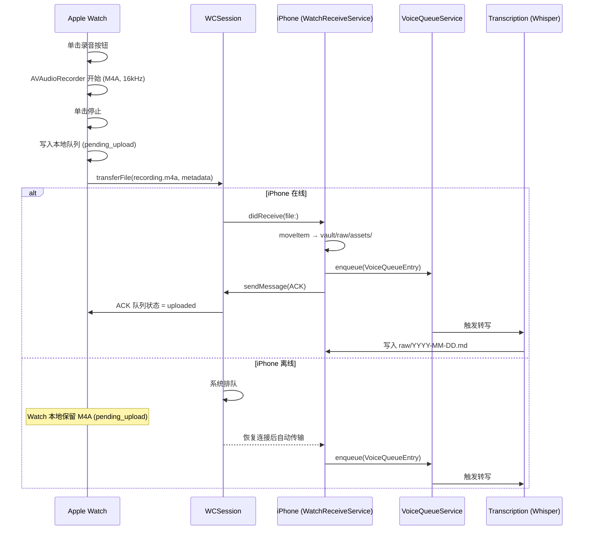

# Design: Apple Watch 一键录音功能架构方案

**Issue**: #96
**状态**: 设计评审中
**里程碑**: post-MVP
**决策日期**: 2026-04-29
**作者**: @cubxxw + Claude

---

## 0. 执行摘要

DayPage 的核心价值是「零摩擦输入」。Apple Watch 提供比 iPhone 更低的输入摩擦：抬腕即录，无需解锁。本文档设计从 Watch 录音到 iPhone Whisper 转写的完整闭环，明确 watchOS/iOS 职责边界、音频传输协议、离线降级策略和 Watch UI 方案。

**推荐方案**：
- **交互**：单击开始 + 单击结束（方案 B）
- **传输**：录完后 WCSession 文件传输（非实时流）
- **离线**：Watch 本地队列 → 恢复连接后自动上传

---

## 1. 背景与约束

### 1.1 watchOS AVAudioRecorder 格式约束

| 参数 | 限制 | 推荐值 |
|---|---|---|
| 格式 | `.m4a` (AAC) 或 `.caf` (PCM/IMA4) | `.m4a` (AAC) |
| 采样率 | 8000–48000 Hz | 16000 Hz（Whisper 最优）|
| 通道 | 单声道 | 单声道（节省空间）|
| 比特率 | ≤128 kbps | 32 kbps（录音质量已足够）|
| 最大录制时长 | 无硬性限制，受存储制约 | 建议 ≤5 分钟 |
| 权限 | `NSMicrophoneUsageDescription`（watchOS Info.plist）| 必须申请 |

**CAF vs M4A**：
- CAF（PCM）：无损，文件大（16kHz mono ≈ 1.9 MB/分钟），转写前不需转码
- M4A（AAC）：有损压缩，文件小（32kbps ≈ 240 KB/分钟），Whisper 可直接处理
- **选择 M4A**：Watch 存储有限，WCSession 传输效率更高，Whisper 原生支持 AAC

### 1.2 WatchConnectivity 传输约束

| 传输方式 | 大小限制 | 延迟 | 离线支持 | 适用场景 |
|---|---|---|---|---|
| `sendMessage` | <64 KB | 实时 | ❌（需连接）| 短控制消息 |
| `transferFile` | 无硬性限制 | 异步队列 | ✅（排队等连接）| 音频文件传输 |
| `updateApplicationContext` | <65.5 KB | 低优先级 | ✅ | 状态同步 |

**音频传输选择 `transferFile`**：
- 支持断连排队（Watch 离线录音的核心需求）
- 系统自动重试
- 不受 64 KB 限制

---

## 2. 架构设计

### 2.1 职责划分

```
┌──────────────────────────────────────────────────────┐
│                  Apple Watch (watchOS)                │
│                                                      │
│  WatchRecordingViewModel                             │
│   ├── AVAudioRecorder (M4A, 16kHz, mono)             │
│   ├── 本地队列 (WatchAudioQueue: JSON 状态文件)       │
│   └── WCSession.transferFile() → iPhone              │
│                                                      │
│  WatchRootView                                       │
│   ├── RecordingView (主交互界面)                     │
│   └── QueueStatusView (待传队列状态)                  │
└──────────────────────────────────────────────────────┘
            │ WCSession.transferFile (M4A 文件)
            │ WCSession.sendMessage  (元数据)
            ▼
┌──────────────────────────────────────────────────────┐
│                    iPhone (iOS)                       │
│                                                      │
│  WatchReceiveService (@MainActor)                    │
│   ├── session(_:didReceive:) — 接收文件              │
│   ├── 写入 vault/raw/assets/ + voice_queue.json      │
│   └── 触发 BackgroundTranscriptionService           │
│                                                      │
│  BackgroundTranscriptionService                      │
│   ├── Whisper 本地转写 (WhisperKit)                  │
│   └── 写入当日 raw/YYYY-MM-DD.md                     │
└──────────────────────────────────────────────────────┘
```

### 2.2 数据流（完整路径）

```
1. 用户在 Watch 单击录音按钮
2. AVAudioRecorder 开始录制 → 文件写入 Watch 沙箱 (tmp/recording-<uuid>.m4a)
3. 用户单击停止
4. WatchRecordingViewModel 将元数据写入本地队列 (WatchAudioQueue)
5. WCSession.transferFile(recordingURL, metadata: [uuid, duration, timestamp])
   ├── iPhone 在线 → 立即传输
   └── iPhone 离线 / 断连 → 系统排队，恢复连接后自动重发
6. iPhone WatchReceiveService.session(_:didReceive:) 触发
7. 文件移动到 vault/raw/assets/<uuid>.m4a
8. voice_queue.json 追加一条 VoiceQueueEntry { id, assetPath, duration, recordedAt }
9. BackgroundTranscriptionService 消费队列，Whisper 转写
10. 转写完成 → 追加到当日 raw/<date>.md，格式与普通 voice memo 相同
11. WCSession.sendMessage({ "ack": uuid }) → Watch 更新本地队列状态为 "uploaded"
```

### 2.3 WatchConnectivity 消息协议

**Watch → iPhone（transferFile metadata）**：
```json
{
  "id": "550e8400-e29b-41d4-a716-446655440000",
  "recordedAt": "2026-04-29T10:30:00Z",
  "durationSeconds": 42.5,
  "fileFormat": "m4a",
  "sampleRate": 16000
}
```

**iPhone → Watch（sendMessage ACK）**：
```json
{
  "type": "ack",
  "id": "550e8400-e29b-41d4-a716-446655440000",
  "status": "received",
  "transcribedAt": "2026-04-29T10:31:00Z"
}
```

**iPhone → Watch（updateApplicationContext 状态同步）**：
```json
{
  "pendingTranscriptions": 2,
  "lastSyncAt": "2026-04-29T10:31:00Z",
  "iPhoneReachable": true
}
```

---

## 3. Watch UI 方案对比

### 方案 A：按住说话（Push-to-Talk）

```
┌─────────────────┐
│                 │
│   🎙️           │
│                 │
│  [按住说话]     │
│                 │
│  松开即发送     │
└─────────────────┘
```

| 优点 | 缺点 |
|---|---|
| 操作直觉 | 手腕需要保持姿势 |
| 无需二次确认 | 最长约 30 秒（腕部疲劳）|
| 类似对讲机体验 | 不适合长录音 |

### 方案 B：单击开始 + 单击结束（推荐）

```
空闲态:               录音中:              完成态:
┌─────────────┐      ┌─────────────┐      ┌─────────────┐
│             │      │  ● 00:42    │      │             │
│    🎙️      │  →   │   录音中…   │  →   │  ✓ 已保存  │
│             │      │             │      │  42秒       │
│  [开始录音] │      │  [停止录音] │      │             │
└─────────────┘      └─────────────┘      └─────────────┘
```

**推荐理由**：适合「数字游民」场景（散步、驾车时手放下录音），支持任意时长，与 iOS 语音备忘录习惯一致。

### 方案 C：表冠长按确认

| 优点 | 缺点 |
|---|---|
| 防误触 | 交互不直觉 |
| 充分利用 Digital Crown | 用户需学习 |

**结论**：推荐方案 B（单击开始+结束）。

---

## 4. 离线队列策略

### 4.1 Watch 本地队列（WatchAudioQueue）

Watch 沙箱中维护 JSON 状态文件，记录录制完毕但尚未确认上传的录音：

```json
{
  "entries": [
    {
      "id": "550e8400-e29b-41d4-a716-446655440000",
      "localPath": "recordings/recording-550e8400.m4a",
      "recordedAt": "2026-04-29T10:30:00Z",
      "durationSeconds": 42.5,
      "status": "pending_upload"
    }
  ]
}
```

`status` 枚举值：`pending_upload` | `uploading` | `uploaded` | `stale`

### 4.2 状态机

```
[录制完成]
    │
    ▼
pending_upload
    │ WCSession.transferFile()（断连时系统排队）
    ▼
uploading
    │ 收到 iPhone ACK
    ▼
uploaded ──→ 30 分钟后自动删除本地 M4A 文件
```

### 4.3 存储清理策略

- `uploaded` 状态超过 30 分钟：删除 Watch 本地 M4A（保留 JSON 条目 7 天）
- `pending_upload` 超过 7 天：标记为 `stale`，显示警告
- Watch 存储剩余 < 50 MB：暂停录制，提示用户

### 4.4 恢复连接时的自动同步

`WCSession.transferFile` 系统级排队保证恢复连接后自动传输。应用层在 `session(_:activationDidCompleteWith:)` 中检查未 ACK 条目，对超时条目重发。

---

## 5. iPhone 侧接收与转写

### 5.1 WatchReceiveService 改造

现有 `WatchReceiveService.swift` 新增：

```swift
func session(_ session: WCSession, didReceive file: WCSessionFile) {
    let metadata = file.metadata ?? [:]
    guard let id = metadata["id"] as? String,
          let uuid = UUID(uuidString: id) else { return }

    let destURL = VaultInitializer.vaultURL
        .appendingPathComponent("raw/assets/\(uuid.uuidString).m4a")

    do {
        let fm = FileManager.default
        if fm.fileExists(atPath: destURL.path) { try fm.removeItem(at: destURL) }
        try fm.moveItem(at: file.fileURL, to: destURL)

        let entry = VoiceQueueEntry(
            id: uuid,
            assetPath: "raw/assets/\(uuid.uuidString).m4a",
            duration: metadata["durationSeconds"] as? Double ?? 0,
            recordedAt: ISO8601DateFormatter().date(
                from: metadata["recordedAt"] as? String ?? "") ?? Date()
        )
        VoiceQueueService.shared.enqueue(entry)

        if session.isReachable {
            session.sendMessage(["type": "ack", "id": id, "status": "received"],
                                replyHandler: nil)
        }
    } catch {
        // 文件仍在 WCSession 临时目录，不崩溃
    }
}
```

### 5.2 转写触发时机

| 触发条件 | 策略 |
|---|---|
| App 在前台 | 立即转写（inline）|
| App 在后台，连接 WiFi | `BGProcessingTask`（低优先级，系统调度）|
| App 被终止 | 下次启动时消费队列 |

---

## 6. Complication 类型选择

| Complication 类型 | 位置 | 展示内容 | 点击行为 |
|---|---|---|---|
| **Corner**（推荐）| 表盘角落 | 🎙️ 图标 | 直接启动录音 |
| Circular | Infograph Modular 圆形 | 🎙️ 图标 | 打开 App |
| Rectangular | Infograph Modular 矩形 | 🎙️ + "上次: 10:30" | 打开 App |

**推荐 Corner Complication**：最快捷（表盘角落一直可见），点击可直接 deep link 到录音界面，实现最简单（`CLKComplicationTemplateCircularSmallSimpleImage`）。

---

## 7. 架构图（Mermaid）



---

## 8. 风险与缓解

| 风险 | 概率 | 影响 | 缓解措施 |
|---|---|---|---|
| Watch 存储不足无法录音 | 中 | 中 | 录制前检查可用空间（< 50 MB 时禁用并提示）|
| WCSession 长期断连导致队列积累 | 低 | 中 | 超过 7 天 `stale` 提醒用户检查配对 |
| M4A 文件传输中断（Watch 掉电）| 低 | 低 | `transferFile` 系统级保证，断点续传 |
| Whisper 转写失败 | 中 | 低 | 转写失败保留原始 M4A，下次重试 |
| watchOS 麦克风权限拒绝 | 低 | 高 | 首次请求权限时显示说明，拒绝后引导至系统设置 |

---

## 9. 非目标

- 实时流式转写（延迟过高，Watch 带宽有限）
- Watch 独立模式（无 iPhone 配对时的独立转写）
- Watch 本地 Whisper 推理（watchOS 计算资源不足）
- 录音编辑（Watch 屏幕过小，保留在 iOS）

---

## 10. 后续实施 Issue 拆分

| 编号 | Issue 标题 | 工作量 | 依赖 |
|---|---|---|---|
| #97 | watchOS Target 添加 + 基础项目结构 | S（2-4h）| 无 |
| #watch-recording | Watch 录音核心功能（AVAudioRecorder + WCSession）| L（8-16h）| #97 |
| #watch-complication | Corner Complication 快捷入口 | S（2-4h）| #97 |
| #watch-queue-ui | Watch 侧队列状态 UI | M（4-8h）| #watch-recording |

---

## 11. 验收标准（本 Design Issue）

- [x] watchOS AVAudioRecorder 权限与格式限制（M4A vs CAF）分析
- [x] WatchConnectivity 消息协议设计（传文件 vs 实时流）
- [x] 离线队列策略（Watch 本地缓存 → 恢复连接后上传）
- [x] 3 种 Watch 交互方案对比 + 推荐理由
- [x] 架构图（Mermaid）+ 数据流说明
- [x] Complication 类型选择（Corner 推荐）
- [ ] 与 @cubxxw review，确认方案可实施

---

*文档版本: v1.0 | 生成于 2026-04-29 | 作者: @cubxxw + Claude*
